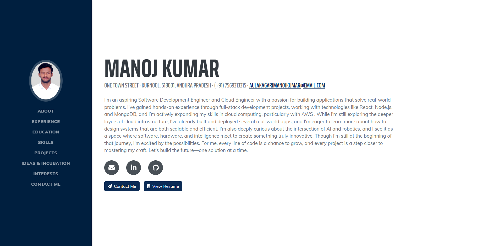

# 🚀 Manoj Kumar | Developer Portfolio

Welcome to my personal developer portfolio website – built to showcase my skills, projects, innovation ideas, and engineering mindset.

🔗 **Live Site:** [portfolio-manojkumar-developer.vercel.app](https://portfolio-manojkumar-developer.vercel.app/)

---

## 📌 About Me

I’m an aspiring **Software Development Engineer** and **Cloud Engineering enthusiast**, passionate about creating impactful, scalable solutions. From serverless email apps to autonomous drone systems and innovative student platforms, I believe in using technology to build a better world.

---

## 🔧 Tech Stack

**Languages & Frameworks**  

**Tools & Platforms**  

---

## 📁 Project Highlights

| Project | Description |
|--------|-------------|
| **Serverless Email Marketing App** | AWS Lambda + SES-based tool to send personalized bulk emails without managing backend |
| **Autonomous Drone Navigation** | Python-based drone depth estimation system using sensors for GPS-denied zones |
| **Hospital Management System** | Java/JSP full-stack app for appointments, billing, and admin roles |
| **To-Do Web App (MERN)** | Task tracking with reminders, CRUD features, and MongoDB backend |

---

## 📷 Screenshots

 <!-- Replace with actual screenshot path -->

---

## 🧠 Contact Me

- 📧 Email: manojcodecraft@gmail.com  
- 🔗 Portfolio: [portfolio-manojkumar-developer.vercel.app](https://portfolio-manojkumar-developer.vercel.app/)
- 🐙 GitHub: [@ManojCodeCraft](https://github.com/ManojCodeCraft)

---

> “Fueling innovation with discipline, and building with a mission.”

---

